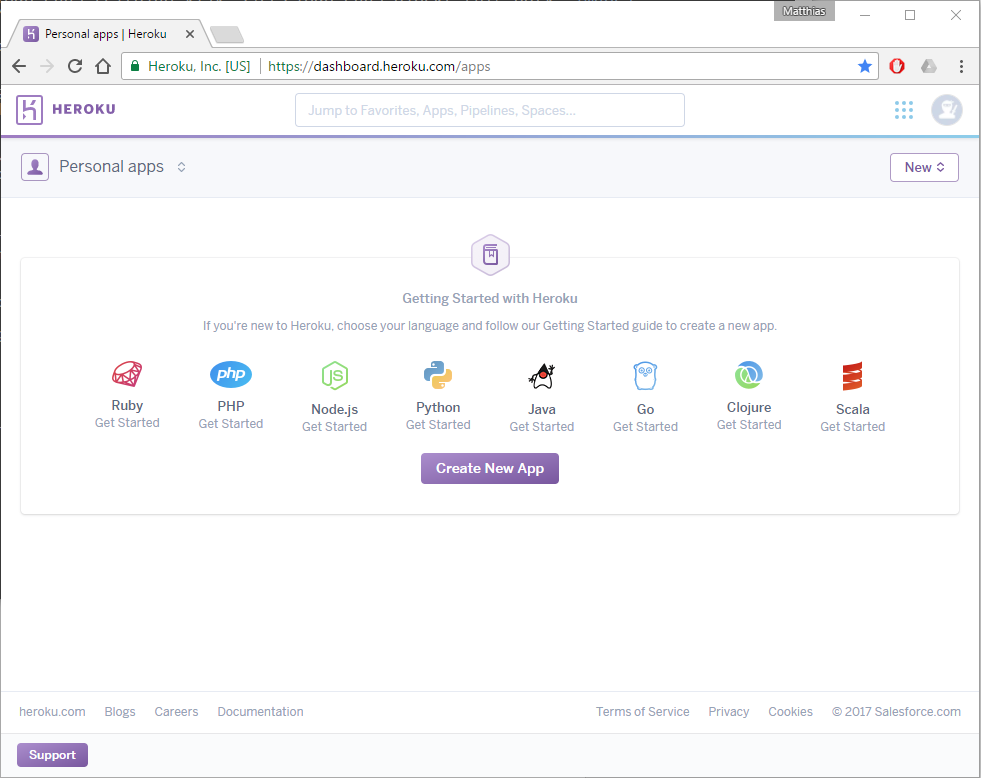
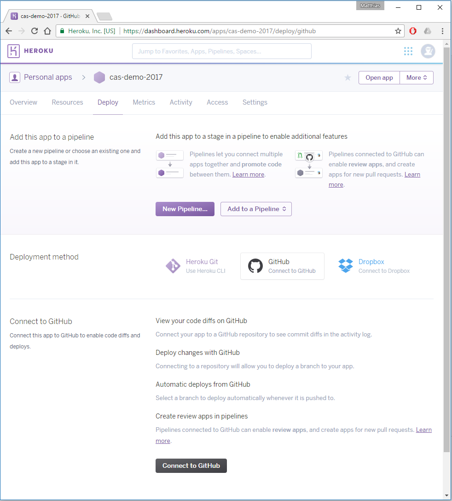
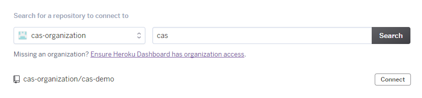

# App auf Heroku deployen

Bei dieser Übung wird die Applikation https://github.com/cas-organization/cas-demo auf Heroku deployt.
Dazu ist ein Heroku Benutzer notwendig. Dieser Benutzer kann gratis (ohne Kreditkarte) erstellt werden.

## Heroku Benutzer erstellen

2. Auf https://heroku.com/ einen Benutzer erstellen

## Neue App auf Heroku erstellen

1. "Create new App" auswählen

2. App Name angeben und Runtime auswählen (Europe)

3. Deployment method "GitHub" auswählen

4. Connect to GitHub

Mit Benutzer "cas-demo" anmelden

5. "cas-organization" auswählen und nach "cas-demo" suchen

6. "Connect" auswählen um mit Repository zu verbinden

7. "Deploy Branch" auswählen um Deployment zu starten

8. Nach dem die Meldung kommt "Your app was successfully deployed" auf "View" klicken um Applikation zu öffnen (geht ein paar Sekunden)

9. Mit "admin" "admin" anmelden

## Bonus: Pipeline einrichten

Heroku erlaubt es, einfache [Deployment Pipelines](https://martinfowler.com/bliki/DeploymentPipeline.html) einzurichten.
Dadurch wird die App in einem ersten Schritt auf einen Entwicklungsstage deployt und erst in einem späteren Schritt in die Produktion. 
